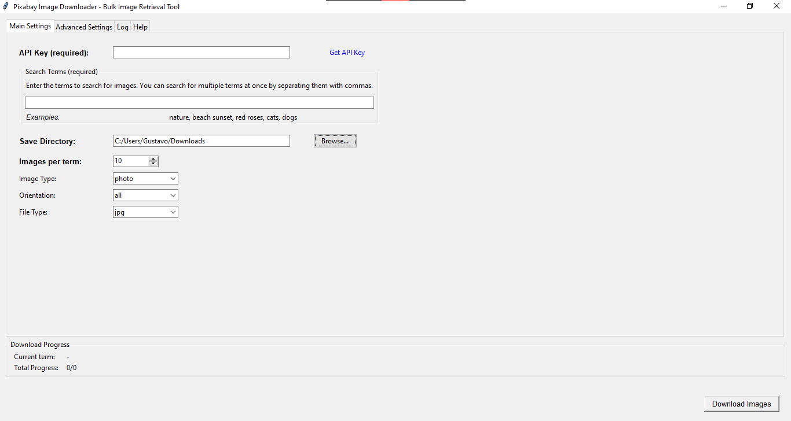

# Pixabay Image Downloader

Um aplicativo completo para download de imagens do Pixabay, com interface gráfica amigável.



## 📋 Conteúdo

- [Recursos](#recursos)
- [Instalação](#instalação)
- [Uso](#uso)
  - [Interface Gráfica](#interface-gráfica)
- [Configuração Avançada](#configuração-avançada)
- [Licença e Atribuição](#licença-e-atribuição)
- [Contribuindo](#contribuindo)

## ✨ Recursos

- **Interface gráfica intuitiva** com explicações detalhadas
- **Vários modos de busca** para especificar múltiplos termos facilmente
- **Personalização completa** de todos os parâmetros da API do Pixabay
- **Barra de progresso em tempo real** mostrando o status do download
- **Interface em abas** para configurações principais, avançadas, logs e ajuda
- **Registro detalhado** de todas as operações

## 🔧 Instalação

1. Clone o repositório:
   ```bash
   git clone https://github.com/seu-usuario/pixabay_scraper.git
   cd pixabay_scraper
   ```

2. Instale as dependências:
   ```bash
   pip install requests
   ```

3. Obtenha uma chave de API do Pixabay:
   - Crie uma conta em [Pixabay](https://pixabay.com)
   - Obtenha sua chave API em [Pixabay API Docs](https://pixabay.com/api/docs/)

## 🚀 Uso

### Interface Gráfica

Para iniciar a aplicação, execute:

```bash
python gui.py
```

#### Guia Rápido da Interface Gráfica

1. **Configurações Principais**:
   - **Chave API**: Insira sua chave API do Pixabay
   - **Termos de Busca**: Digite um ou mais termos de busca separados por vírgulas
   - **Diretório de Salvamento**: Escolha onde as imagens serão salvas
   - **Imagens por Termo**: Número de imagens a baixar para cada termo
   - **Tipo de Imagem**: Fotos, ilustrações, vetores ou todos
   - **Orientação**: Horizontal, vertical ou ambos
   - **Tipo de Arquivo**: Formato para salvar as imagens (jpg, png)

2. **Configurações Avançadas**:
   - **Categoria**: Filtre por categorias pré-definidas do Pixabay
   - **Dimensões Mínimas**: Defina largura/altura mínima das imagens
   - **Cores**: Filtre por cores predominantes
   - **Escolha do Editor**: Apenas imagens selecionadas pelos editores do Pixabay
   - **Busca Segura**: Filtra conteúdo adulto
   - **Ordenação**: Por popularidade ou mais recentes
   - **Idioma**: Idioma para busca dos termos

3. **Log e Progresso**:
   - Visualize o progresso detalhado do download
   - Acompanhe o termo atual sendo baixado
   - Veja o progresso total com a barra de progresso
   - Consulte o log detalhado para informações e erros

4. **Ajuda**:
   - Guia completo de uso da aplicação
   - Dicas para otimizar suas buscas
   - Referência dos parâmetros disponíveis

## ⚙️ Configuração Avançada

### Configurando a Chave API

Você pode fornecer sua chave API de duas maneiras:

1. Diretamente na interface gráfica
2. Criando um arquivo `secrets.py` com o seguinte conteúdo:
   ```python
   # secrets.py
   api_key = "SUA_CHAVE_API"
   ```

### Personalização Completa

O Pixabay Image Downloader suporta todos os parâmetros da API do Pixabay:

- **Tipo de Imagem**: Fotos, ilustrações, vetores, todos
- **Orientação**: Horizontal, vertical, todos
- **Categoria**: Diversas categorias pré-definidas (natureza, pessoas, etc.)
- **Dimensões Mínimas**: Filtre por largura/altura mínima
- **Cores**: Filtre por cores predominantes
- **Escolha do Editor**: Imagens selecionadas por editores do Pixabay
- **Busca Segura**: Filtre conteúdo adulto
- **Ordenação**: Por popularidade ou mais recentes
- **Idioma**: Código do idioma para busca

## 📝 Licença e Atribuição

Este software é distribuído sob a licença MIT. Veja o arquivo [LICENSE](LICENSE) para detalhes.

**Importante**: As imagens baixadas estão sujeitas à [Licença de Conteúdo do Pixabay](https://pixabay.com/service/license/).

## 👥 Contribuindo

Contribuições são bem-vindas! Sinta-se à vontade para abrir issues ou pull requests com melhorias.
